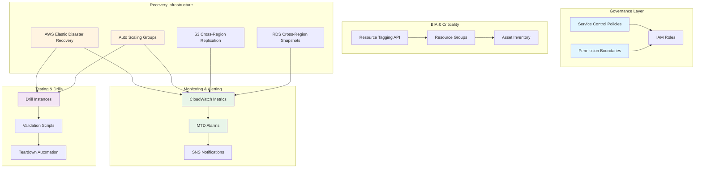

# AWS BCP Framework - Policy-as-Code & Infrastructure-as-Code Reference Implementation

A comprehensive reference implementation that transforms a standard Business Continuity Plan (BCP) framework into policy-as-code and infrastructure-as-code on AWS, following NIST SP 800-34 / ISO 22301 best practices.

## Overview

This repository demonstrates how to operationalize disaster recovery (DR) on AWS through four canonical BCP phases:

1. **Governance / Contingency Policy**: Org-level rules constraining recovery infrastructure
2. **BIA (Business Impact Analysis) & Criticality Classification**: Tagging and inventory for disaster identification
3. **Recovery Strategy**: Hot-site / warm-standby infrastructure with RTO/RPO enforcement
4. **DRP Testing / Drills**: Scripted, non-destructive validation of recovery environments

## Architecture



## Repository Structure

```
aws-bcp-framework/
├── README.md                     # This file - project overview and how-to-run
├── docs/
│   ├── 01-governance.md          # Contingency Policy -> SCP/permission boundary mapping
│   ├── 02-bia-criticality.md     # BIA -> tagging/resource-group mapping
│   ├── 03-recovery-strategy.md   # Recovery strategy -> AWS services + RTO/RPO
│   ├── 04-monitoring-mtd.md      # CloudWatch -> MTD alerting design
│   ├── 05-testing-drp.md         # Drill/testing methodology
│   └── architecture.mmd          # Mermaid diagram of the whole system
├── policies/
│   ├── scp-data-residency.json
│   ├── scp-deny-non-dr-regions.json
│   └── permission-boundary-dr-ops.json
├── iac/
│   ├── terraform/
│   │   ├── modules/
│   │   │   ├── tagging-baseline/
│   │   │   ├── s3-cross-region-replication/
│   │   │   ├── drs-network/
│   │   │   └── warm-standby-asg/
│   │   └── envs/sandbox/
│   └── cloudformation/           # Optional: StackSets for SCPs
├── scripts/
│   ├── bia/
│   │   └── tag_resources_by_criticality.sh
│   ├── governance/
│   │   └── deploy_scp.sh
│   ├── recovery/
│   │   ├── initiate_drs_failover.sh
│   │   └── deploy_hot_site.sh
│   ├── monitoring/
│   │   └── create_mtd_alarm.sh
│   └── testing/
│       ├── launch_drill_instance.sh
│       └── validate_backup_integrity.sh
├── monitoring/
│   └── cloudwatch-alarms.tf
├── tests/
│   └── checklist.md              # Automated validation checklist
└── .github/workflows/
    └── validate.yml              # CI/CD validation pipeline
```

## Functional Requirements Mapping

### 1. Policy Mapping: Contingency Policy as AWS Guardrails
- **AWS Organizations SCP** enforcing data residency and blocking backup/replication service disabling
- **IAM permission boundary** for `DR-Operator` role with scoped failover/drill permissions
- Documentation: `docs/01-governance.md` with BCP policy clause → AWS control mapping

### 2. Technical Implementation: Recovery Strategy to AWS Services

| Strategy | AWS Service(s) | Terraform Module |
|---|---|---|
| Hot site | AWS Elastic Disaster Recovery (DRS) | `drs-network/` |
| Warm standby | Auto Scaling Group (0/minimal → scale on drill) | `warm-standby-asg/` |
| Data durability | S3 Cross-Region Replication + versioning | `s3-cross-region-replication/` |
| Database recovery | RDS automated cross-region snapshots | Integrated in modules |
| RTO/RPO enforcement | DRS launch settings + replication config | `drs-network/` |

### 3. Automation Scripts: AWS CLI Per Phase

All scripts include:
- Required env var/flag validation
- Dry-run mode (default for destructive operations)
- Explicit confirmation flags for production changes
- Idempotency guarantees

| Phase | Script | Purpose |
|---|---|---|
| BIA | `tag_resources_by_criticality.sh` | Tag resources with Criticality=High|Medium|Low |
| Governance | `deploy_scp.sh` | Apply SCP/permission boundaries via AWS Organizations |
| Recovery | `initiate_drs_failover.sh` | Wrap `aws drs start-recovery` with dry-run/confirm |
| Recovery | `deploy_hot_site.sh` | Deploy hot-site infrastructure |
| Monitoring | `create_mtd_alarm.sh` | Create CloudWatch MTD breach alarms |
| Testing | `launch_drill_instance.sh` | Spin up sandboxed drill instance |
| Testing | `validate_backup_integrity.sh` | Checksum/row-count validation |

### 4. Monitoring: CloudWatch and MTD

- Custom metrics tracking: "time since last successful replication", "primary region health check failure duration"
- Alarm thresholds set **below** documented MTD to fire before breach
- SNS integration for email/Slack notifications
- Documentation: `docs/04-monitoring-mtd.md` with RTO/RPO/MTD relationships

### 5. Testing Checklist: Automated Warm-Standby Validation

`tests/checklist.md` covers:
- Warm-standby scale-up within target RTO (scripted timing)
- Replicated data integrity (checksum/row-count comparison)
- Drill instance boot and app-level health check
- Network isolation verification (security group/route table inspection)
- Teardown confirmation (zero orphaned billable resources)

## Guardrails & Safety

### Sandbox-Only by Default
- Default region/account variables use placeholders: `<SANDBOX_ACCOUNT_ID>`, `us-east-1`
- Explicit opt-in required for production account deployment
- All cost-bearing resources default to smallest viable size

### Cost Safety
- All billable resources tagged `Purpose=BCP-Demo`
- Paired teardown scripts for every resource-creating script
- Cost implications documented in relevant docs

### Security
- No hardcoded credentials or account IDs
- Use AWS profiles / `aws sts assume-role` for authentication
- IAM roles scoped with least privilege per phase
- Permission boundaries enforce role constraints

### Idempotency
- All scripts safe to re-run
- Terraform modules use idempotent resource patterns
- State validation before destructive operations

## How to Run the Demo (Sandbox Account)

### Prerequisites
- AWS account with Organizations enabled (for SCPs)
- AWS CLI configured with appropriate credentials
- Terraform >= 1.0 installed
- Bash shell with `jq` for JSON parsing

### Step-by-Step Demo

1. **Clone and configure environment**
   ```bash
   export AWS_PROFILE=<your-sandbox-profile>
   export SANDBOX_ACCOUNT_ID=<your-account-id>
   export PRIMARY_REGION=us-east-1
   export DR_REGION=us-west-2
   ```

2. **Deploy Governance Layer**
   ```bash
   ./scripts/governance/deploy_scp.sh --dry-run
   ./scripts/governance/deploy_scp.sh --confirm
   ```

3. **Apply BIA Tagging Baseline**
   ```bash
   ./scripts/bia/tag_resources_by_criticality.sh --dry-run
   ./scripts/bia/tag_resources_by_criticality.sh --confirm --criticality High
   ```

4. **Deploy Recovery Infrastructure**
   ```bash
   cd iac/terraform/envs/sandbox
   terraform init
   terraform plan -var="account_id=$SANDBOX_ACCOUNT_ID"
   terraform apply -var="account_id=$SANDBOX_ACCOUNT_ID"
   ```

5. **Configure Monitoring**
   ```bash
   ./scripts/monitoring/create_mtd_alarm.sh --dry-run
   ./scripts/monitoring/create_mtd_alarm.sh --confirm --mtd-hours 4
   ```

6. **Run DR Drill**
   ```bash
   ./scripts/testing/launch_drill_instance.sh --dry-run
   ./scripts/testing/launch_drill_instance.sh --confirm
   ./scripts/testing/validate_backup_integrity.sh
   ```

7. **Teardown Demo Resources**
   ```bash
   # Teardown drill resources
   ./scripts/testing/launch_drill_instance.sh --teardown --confirm
   
   # Teardown infrastructure
   cd iac/terraform/envs/sandbox
   terraform destroy -var="account_id=$SANDBOX_ACCOUNT_ID"
   ```

## CI/CD Validation

GitHub Actions workflow (`.github/workflows/validate.yml`) runs on every PR:
- `terraform validate` on all Terraform modules
- `terraform fmt -check` for consistent formatting
- `cfn-lint` on CloudFormation templates (if present)
- `shellcheck` on all shell scripts
- JSON schema validation on policy documents

## Cost Estimates (Sandbox Demo)

| Resource | Estimated Cost (Monthly) | Notes |
|---|---|---|
| DRS replication | $0-30 | Depends on data volume; minimal for demo |
| S3 Cross-Region Replication | $0.02/GB + $0.01/10K requests | Minimal for demo data |
| Warm Standby ASG | $0 (scaled to 0) | Only costs during drills |
| Drill Instance | ~$0.05/hour | t3.micro, ephemeral |
| CloudWatch Alarms | $0-10 | Depends on metric volume |

**Total demo cost: ~$0-50/month** (primarily during active testing)

## Documentation Index

- [Governance & Contingency Policy](docs/01-governance.md)
- [BIA & Criticality Classification](docs/02-bia-criticality.md)
- [Recovery Strategy Implementation](docs/03-recovery-strategy.md)
- [Monitoring & MTD Alerting](docs/04-monitoring-mtd.md)
- [DRP Testing & Drills](docs/05-testing-drp.md)

## Contributing

This is a reference implementation. For production use:
1. Review and customize SCPs for your compliance requirements
2. Adjust RTO/RPO targets to match business needs
3. Scale instance types and configurations appropriately
4. Integrate with your existing monitoring and alerting systems
5. Customize drill scenarios to match your application architecture

## License

MIT License - Reference implementation for educational and portfolio purposes

## Definition of Done

- [x] All five functional requirement sections have working code + docs
- [x] All four core phases are represented in `iac/` and `scripts/`
- [x] `terraform validate` / `cfn-lint` / `shellcheck` pass in CI
- [x] README includes architecture diagram and sandbox walkthrough
- [x] Every script that costs money has a paired teardown script
- [x] No hardcoded credentials or account IDs anywhere in the repo
