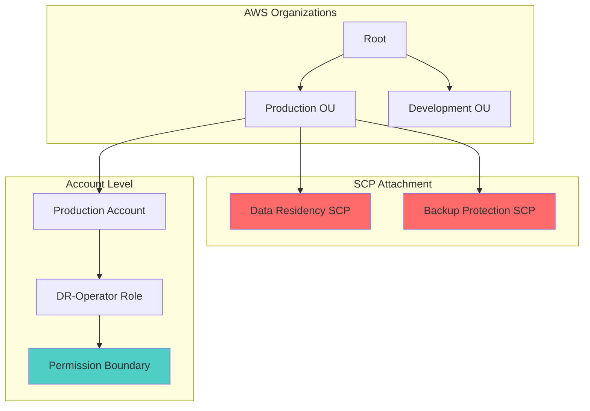

# Governance & Contingency Policy

This document maps Business Continuity Plan (BCP) contingency policy clauses to AWS control mechanisms through Service Control Policies (SCPs) and IAM permission boundaries.

## Overview

Governance in the BCP framework establishes the org-level rules that constrain how recovery infrastructure can be built and who can touch it. In AWS, this is implemented through:

- **Service Control Policies (SCPs)** - Organization-level guardrails that apply to all accounts in an OU
- **Permission Boundaries** - IAM role constraints that limit maximum permissions regardless of inline policies
- **IAM Roles** - Least-privilege roles for specific DR operations

## BCP Policy Clause → AWS Control Mapping

| BCP Policy Clause | AWS Control | Enforcement Mechanism | Policy File |
|---|---|---|---|
| Data residency requirements must be enforced | SCP: Deny non-approved regions | Organizations SCP applied to OU | `scp-data-residency.json` |
| Backup and replication services cannot be disabled | SCP: Deny backup service modifications | Organizations SCP applied to OU | `scp-deny-non-dr-regions.json` |
| DR operators can trigger failovers but cannot modify governance | Permission Boundary: DR-Operator | IAM permission boundary on role | `permission-boundary-dr-ops.json` |
| DR operators cannot delete production backups | Permission Boundary: DR-Operator | Explicit deny on backup deletion | `permission-boundary-dr-ops.json` |
| DR operators cannot touch non-DR-tagged resources | Permission Boundary: DR-Operator | Condition key on resource tags | `permission-boundary-dr-ops.json` |

## Service Control Policies

### SCP 1: Data Residency Enforcement

**File:** `policies/scp-data-residency.json`

**Purpose:** Enforces that all AWS resources are created and operated only in approved regions (primary and DR regions). This ensures data residency compliance and prevents accidental deployment in non-compliant regions.

**Key Controls:**
- Denies all AWS actions in regions not listed in the approved list
- Allows actions in primary region (e.g., `us-east-1`) and DR region (e.g., `us-west-2`)
- Applies to all services except global services (IAM, Route 53, CloudFront)

**Implementation:**
```bash
./scripts/governance/deploy_scp.sh --policy-file policies/scp-data-residency.json --ou-id <ou-id>
```

### SCP 2: Backup & Replication Service Protection

**File:** `policies/scp-deny-non-dr-regions.json`

**Purpose:** Prevents disabling or modifying critical backup and replication services that are essential for disaster recovery.

**Key Controls:**
- Denies deletion of S3 buckets with versioning enabled
- Denies disabling S3 Cross-Region Replication
- Denies deletion of RDS automated snapshots
- Denies stopping AWS Elastic Disaster Recovery (DRS) replication
- Denies modification of backup retention policies below minimum thresholds

**Rationale:** These controls ensure that once backup infrastructure is established, it cannot be accidentally or maliciously disabled, maintaining RPO guarantees.

## IAM Permission Boundaries

### DR-Operator Permission Boundary

**File:** `policies/permission-boundary-dr-ops.json`

**Purpose:** Defines the maximum permissions that any DR operator role can have, regardless of inline policies attached to the role.

**Allowed Actions:**
- `drs:StartRecovery` - Initiate DRS failover
- `drs:Describe*` - Read-only DRS operations
- `ec2:RunInstances` - Launch drill instances (with tag conditions)
- `ec2:TerminateInstances` - Terminate drill instances (with tag conditions)
- `autoscaling:SetDesiredCapacity` - Scale warm standby ASG
- `cloudwatch:PutMetricAlarm` - Create monitoring alarms
- `cloudwatch:DescribeAlarms` - Read alarm state

**Denied Actions:**
- `organizations:*` - Cannot modify SCPs or OU structure
- `iam:DeleteRole` / `iam:DeletePolicy` - Cannot delete IAM resources
- `s3:DeleteBucket` / `s3:DeleteObjectVersion` - Cannot delete backups
- `rds:DeleteDBSnapshot` - Cannot delete RDS snapshots
- `ec2:TerminateInstances` on resources without `Purpose=DR-Drill` tag

**Condition Keys:**
- `aws:ResourceTag/Purpose=DR-Drill` - Restricts destructive actions to drill resources only
- `aws:ResourceTag/Criticality=High` - Allows operations on high-criticality resources

## Deployment Architecture



## Implementation Steps

### 1. Deploy SCPs to Organization Unit

```bash
# Set environment variables
export AWS_PROFILE=organizations-admin
export OU_ID=<your-production-ou-id>

# Deploy data residency SCP
./scripts/governance/deploy_scp.sh \
  --policy-file policies/scp-data-residency.json \
  --ou-id $OU_ID \
  --description "Enforce data residency to approved regions"

# Deploy backup protection SCP
./scripts/governance/deploy_scp.sh \
  --policy-file policies/scp-deny-non-dr-regions.json \
  --ou-id $OU_ID \
  --description "Protect backup and replication services"
```

### 2. Create DR-Operator Role with Permission Boundary

```bash
# Create the permission boundary policy
aws iam create-policy \
  --policy-name DR-Operator-Permission-Boundary \
  --policy-document file://policies/permission-boundary-dr-ops.json

# Create the DR-Operator role with the permission boundary
aws iam create-role \
  --role-name DR-Operator \
  --description "Role for disaster recovery operations with scoped permissions" \
  --permissions-boundary arn:aws:iam::<account-id>:policy/DR-Operator-Permission-Boundary \
  --assume-role-policy-document file://policies/trust-policy.json

# Attach inline policy for specific DR operations
aws iam put-role-policy \
  --role-name DR-Operator \
  --policy-name DR-Operations \
  --policy-document file://policies/dr-operator-inline-policy.json
```

### 3. Validate SCP Enforcement

```bash
# Test that non-approved regions are blocked
aws ec2 run-instances \
  --region us-south-1 \
  --image-id ami-12345678 \
  --instance-type t3.micro
# Expected: AccessDenied by SCP

# Test that approved regions work
aws ec2 run-instances \
  --region us-east-1 \
  --image-id ami-12345678 \
  --instance-type t3.micro
# Expected: Success (if other permissions allow)
```

### 4. Validate Permission Boundary

```bash
# Assume the DR-Operator role
aws sts assume-role \
  --role-arn arn:aws:iam::<account-id>:role/DR-Operator \
  --role-session-name DR-Test

# Test that SCP modification is blocked
aws organizations list-roots
# Expected: AccessDenied by permission boundary

# Test that backup deletion is blocked
aws s3 delete-bucket --bucket my-backup-bucket
# Expected: AccessDenied by permission boundary

# Test that allowed operations work
aws drs describe-recovery-instances
# Expected: Success
```

## Audit & Compliance

### SCP Compliance Monitoring

Use AWS CloudTrail to monitor SCP violations:
```bash
aws cloudtrail lookup-events \
  --lookup-attributes AttributeKey=EventSource,AttributeValue=organizations.amazonaws.com \
  --max-results 50
```

### Permission Boundary Compliance

Use AWS IAM Access Analyzer to validate that roles stay within permission boundaries:
```bash
aws accessanalyzer list-findings \
  --analyzer-arn arn:aws:access-analyzer:<region>:<account-id>:analyzer/DR-Compliance
```

## Cost Implications

- **SCPs:** No direct cost - part of AWS Organizations (free)
- **IAM Roles:** No direct cost
- **CloudTrail Logging:** ~$0.10 per 100,000 events (minimal for governance events)

## References

- [AWS Organizations SCP Documentation](https://docs.aws.amazon.com/organizations/latest/userguide/orgs_manage_policies_scps.html)
- [IAM Permission Boundaries](https://docs.aws.amazon.com/IAM/latest/UserGuide/access_policies_boundaries.html)
- [NIST SP 800-34 Contingency Planning](https://csrc.nist.gov/publications/detail/sp/800-34/rev-1/final)
