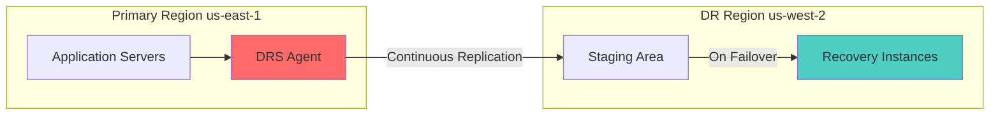
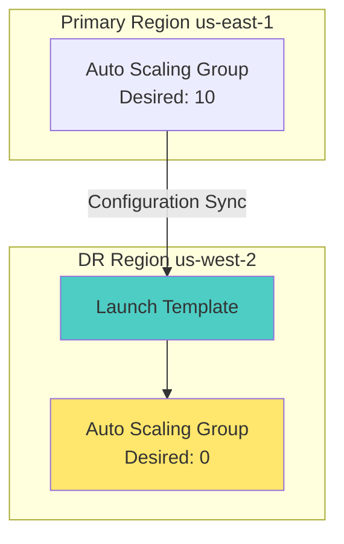
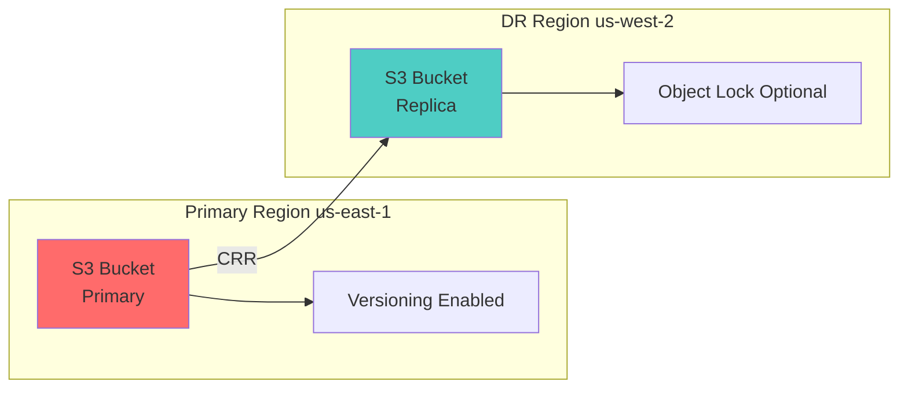
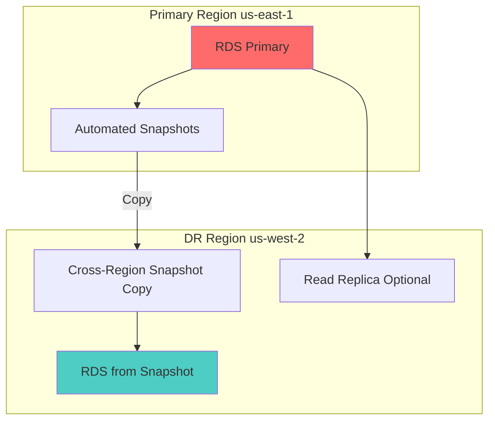

# Recovery Strategy Implementation

This document maps BCP recovery strategies to concrete AWS services and configurations, with specific RTO/RPO enforcement mechanisms.

## Overview

Recovery strategies define how systems are restored after a disaster. This framework implements three primary strategies using AWS native services:

1. **Hot Site** - AWS Elastic Disaster Recovery (DRS) with continuous replication
2. **Warm Standby** - Auto Scaling Groups scaled to 0/minimal, scaled on demand
3. **Backup/Restore** - Cross-region snapshots with manual or automated restoration

## Recovery Strategy to AWS Service Mapping

| Strategy | AWS Service(s) | RTO Target | RPO Target | Terraform Module |
|---|---|---|---|---|
| Hot Site | AWS Elastic Disaster Recovery (DRS) | < 1 hour | < 5 minutes | `drs-network/` |
| Warm Standby | Auto Scaling Group + Launch Template | < 4 hours | < 1 hour | `warm-standby-asg/` |
| Data Durability | S3 Cross-Region Replication + Versioning | < 1 hour | < 15 minutes | `s3-cross-region-replication/` |
| Database Recovery | RDS Cross-Region Automated Snapshots + Read Replica | < 1 hour | < 5 minutes | Integrated in modules |
| Application State | DynamoDB Global Tables | < 1 minute | < 1 second | Integrated in modules |

## Hot Site: AWS Elastic Disaster Recovery (DRS)

### Architecture



### Configuration Parameters

| Parameter | Recommended Value | RTO Impact | RPO Impact |
|---|---|---|---|
| Replication Frequency | Continuous | Minimal | Minimal |
| Staging Area Subnet | Private subnet in DR region | Low | Low |
| Launch Instance Type | Same as production | Low | Low |
| Boot Volume Type | gp3 (same as production) | Low | Low |
| Data Volume Encryption | KMS CMK in DR region | Low | Low |

### Terraform Module: `drs-network/`

**Key Resources:**
- `aws_drs_source_server` - DRS source server configuration
- `aws_drs_replication_configuration_template` - Replication settings
- `aws_drs_launch_configuration_template` - Recovery instance launch settings
- `aws_kms_key` - KMS key for DR region encryption
- `aws_subnet` - Staging area subnet in DR region

**RTO/RPO Enforcement:**
- RPO: Set by continuous replication (typically < 1 minute)
- RTO: Configured via `aws_drs_launch_configuration_template` with:
  - Pre-warmed staging area
  - Instance type matching production
  - Network pre-configuration

### Deployment

```bash
cd iac/terraform/modules/drs-network
terraform init
terraform plan \
  -var="primary_region=us-east-1" \
  -var="dr_region=us-west-2" \
  -var="source_server_id=i-1234567890abcdef0"
terraform apply
```

### Failover Execution

```bash
./scripts/recovery/initiate_drs_failover.sh \
  --source-server-id i-1234567890abcdef0 \
  --dr-region us-west-2 \
  --dry-run

# After validation
./scripts/recovery/initiate_drs_failover.sh \
  --source-server-id i-1234567890abcdef0 \
  --dr-region us-west-2 \
  --confirm
```

## Warm Standby: Auto Scaling Group

### Architecture



### Configuration Parameters

| Parameter | Recommended Value | RTO Impact | RPO Impact |
|---|---|---|---|
| Min/Max/Desired Capacity | 0/10/0 (normal), 0/10/5 (drill) | Medium | N/A |
| Instance Type | Same as production | Low | N/A |
| Health Check Grace Period | 300 seconds | Low | N/A |
| Scaling Cooldown | 300 seconds | Low | N/A |

### Terraform Module: `warm-standby-asg/`

**Key Resources:**
- `aws_autoscaling_group` - Warm standby ASG in DR region
- `aws_launch_template` - Instance configuration matching production
- `aws_security_group` - Network rules for DR environment
- `aws_cloudwatch_metric_alarm` - Scale-up trigger on drill/failover

**RTO Enforcement:**
- RTO: Configured via ASG scaling policies and instance launch time
- Target RTO < 4 hours achieved by:
  - Pre-configured launch templates
  - AMI pre-built and available in DR region
  - Network pre-configured (VPC, subnets, security groups)

### Deployment

```bash
cd iac/terraform/modules/warm-standby-asg
terraform init
terraform plan \
  -var="dr_region=us-west-2" \
  -var="instance_type=t3.medium" \
  -var="min_size=0" \
  -var="max_size=10" \
  -var="desired_capacity=0"
terraform apply
```

### Scale-Up for Drill

```bash
# Scale up warm standby for drill
aws autoscaling set-desired-capacity \
  --auto-scaling-group-name dr-warm-standby-asg \
  --desired-capacity 2 \
  --region us-west-2

# Or use the script
./scripts/recovery/deploy_hot_site.sh \
  --asg-name dr-warm-standby-asg \
  --capacity 2 \
  --dr-region us-west-2 \
  --purpose DR-Drill
```

## Data Durability: S3 Cross-Region Replication

### Architecture



### Configuration Parameters

| Parameter | Recommended Value | RTO Impact | RPO Impact |
|---|---|---|---|
| Replication Time Control (RTC) | Enabled (15 minutes) | Low | Low |
| Versioning | Enabled | Low | Low |
| Object Lock | Governance mode (optional) | Low | Low |
| Storage Class | Standard → Standard (DR) | Low | Low |

### Terraform Module: `s3-cross-region-replication/`

**Key Resources:**
- `aws_s3_bucket` - Primary and replica buckets
- `aws_s3_bucket_versioning` - Versioning on both buckets
- `aws_s3_bucket_replication_configuration` - CRR rules
- `aws_s3_bucket_server_side_encryption_configuration` - Encryption
- `aws_s3_bucket_public_access_block` - Security

**RTO/RPO Enforcement:**
- RPO: Set by Replication Time Control (15 minutes max)
- RTO: Near-instant (data already replicated, just switch endpoint)

### Deployment

```bash
cd iac/terraform/modules/s3-cross-region-replication
terraform init
terraform plan \
  -var="primary_region=us-east-1" \
  -var="dr_region=us-west-2" \
  -var="bucket_prefix=company-data"
terraform apply
```

### Failover Procedure

```bash
# Update application to use DR bucket endpoint
# (This is application-specific, typically via configuration update)

# Verify replication status
aws s3api get-replication-configuration \
  --bucket company-data-primary \
  --region us-east-1

# Check replication metrics
aws cloudwatch get-metric-statistics \
  --namespace AWS/S3 \
  --metric-name ReplicationLatency \
  --dimensions Name=BucketName,Value=company-data-primary \
  --start-time $(date -u -d '1 hour ago' +%Y-%m-%dT%H:%M:%SZ) \
  --end-time $(date -u +%Y-%m-%dT%H:%M:%SZ) \
  --period 300 \
  --statistics Average
```

## Database Recovery: RDS Cross-Region Snapshots

### Architecture



### Configuration Parameters

| Parameter | Recommended Value | RTO Impact | RPO Impact |
|---|---|---|---|
| Backup Retention Period | 7 days | Low | Low |
| Backup Window | 03:00-04:00 UTC | Low | Low |
| Snapshot Copy to DR Region | Enabled | Low | Low |
| Multi-AZ | Primary only (DR region) | Low | Low |

### RTO/RPO Enforcement:
- RPO: Set by snapshot frequency (typically 15 minutes with automated backups)
- RTO: 1-2 hours for snapshot restore (depends on database size)

### Deployment (Integrated in modules)

```bash
# RDS resources are typically integrated into application-specific modules
# Example configuration in terraform:

resource "aws_db_instance" "primary" {
  allocated_storage    = 100
  storage_type         = "gp3"
  engine               = "postgres"
  engine_version       = "14.7"
  instance_class       = "db.t3.medium"
  db_name              = "productiondb"
  backup_retention_period = 7
  backup_window        = "03:00-04:00"
  multi_az             = true
  
  tags = {
    Criticality = "High"
    RTO         = "1"
    RPO         = "5"
    DR-Region   = "us-west-2"
  }
}

resource "aws_db_snapshot_copy" "dr_snapshot" {
  source_db_snapshot_identifier = aws_db_instance.primary.arn
  target_db_snapshot_identifier = "production-dr-snapshot"
  source_region = "us-east-1"
  
  tags = {
    Purpose = "DR-Backup"
  }
}
```

## RTO/RPO Enforcement Summary

### RTO Enforcement Mechanisms

| Strategy | Enforcement Point | Mechanism |
|---|---|---|
| Hot Site (DRS) | Launch configuration | Pre-warmed staging area, matching instance types |
| Warm Standby | ASG configuration | Pre-built AMI, launch templates, network pre-config |
| S3 CRR | Replication config | Replication Time Control (RTC) |
| RDS | Snapshot configuration | Automated snapshots + cross-region copy |

### RPO Enforcement Mechanisms

| Strategy | Enforcement Point | Mechanism |
|---|---|---|
| Hot Site (DRS) | Replication settings | Continuous replication |
| Warm Standby | N/A | Stateless by design (RPO not applicable) |
| S3 CRR | Replication config | Replication Time Control (15 min max) |
| RDS | Backup window | Automated snapshots (15 min frequency) |

## Cost Implications

| Service | Cost Factors | Monthly Estimate (Demo) |
|---|---|---|
| DRS | $0.05/GB/month + $0.015/GB data transfer | $10-50 |
| Warm Standby ASG | $0 when scaled to 0, $0.05/hour during drill | $0-10 |
| S3 CRR | $0.02/GB transfer + storage costs | $5-20 |
| RDS Snapshots | $0.095/GB/month snapshot storage | $5-15 |

**Total demo cost: ~$20-95/month** (primarily DRS and storage)

## Failback Procedure

After primary region recovery:

1. **DRS Failback**
   ```bash
   aws drs initiate-failback \
     --recovery-instance-id i-recovery-123456 \
     --source-server-id i-source-123456
   ```

2. **Warm Standby Failback**
   - Scale down DR ASG to 0
   - Verify primary ASG is healthy
   - Update DNS to point to primary

3. **S3 Failback**
   - Enable reverse CRR (DR → Primary)
   - Wait for sync completion
   - Update application endpoints

4. **RDS Failback**
   - Create snapshot of DR instance
   - Copy snapshot to primary region
   - Restore in primary region
   - Promote to primary

## References

- [AWS Elastic Disaster Recovery](https://docs.aws.amazon.com/drs/latest/userguide/what-is-drs.html)
- [S3 Cross-Region Replication](https://docs.aws.amazon.com/AmazonS3/latest/userguide/replication.html)
- [RDS Cross-Region Snapshots](https://docs.aws.amazon.com/AmazonRDS/latest/UserGuide/USER_ReadRepl.html#USER_ReadRepl.CrossRegion)
- [Auto Scaling Groups](https://docs.aws.amazon.com/autoscaling/ec2/userguide/AutoScalingGroup.html)
