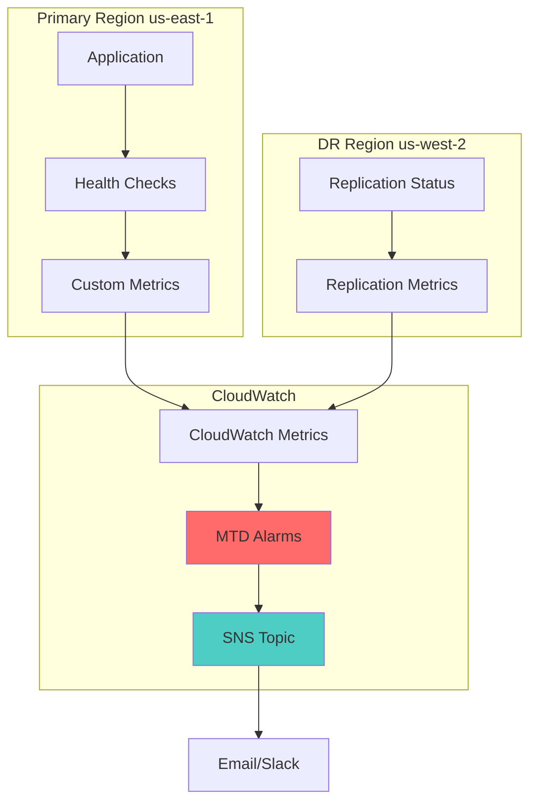

# Monitoring & MTD Alerting

This document designs CloudWatch alarms and metrics that approximate Maximum Tolerable Downtime (MTD) breach risk, with alarms configured to fire **before** MTD is breached.

## Overview

Maximum Tolerable Downtime (MTD) is the maximum length of time a business function can be unavailable before causing unacceptable business impact. This framework implements proactive monitoring that alerts when MTD breach risk approaches, enabling intervention before the threshold is crossed.

## RTO, RPO, and MTD Relationships

| Metric | Definition | Target (High Criticality) | Target (Medium Criticality) | Target (Low Criticality) |
|---|---|---|---|---|
| **RTO** (Recovery Time Objective) | Target time to restore service after disaster | 1 hour | 4 hours | 24 hours |
| **RPO** (Recovery Point Objective) | Target acceptable data loss | 5 minutes | 1 hour | 4 hours |
| **MTD** (Maximum Tolerable Downtime) | Maximum acceptable downtime before business impact | 2 hours | 8 hours | 48 hours |

**Key Insight:** MTD > RTO. The gap between RTO and MTD provides buffer time for detection, decision-making, and recovery execution. Monitoring alarms are set at **MTD - RTO** to provide early warning.

## Monitoring Architecture



## CloudWatch Metrics for MTD Monitoring

### 1. Primary Region Health Check Failure Duration

**Metric Name:** `DR/PrimaryRegionHealthCheckFailureDuration`

**Purpose:** Track how long the primary region has been unhealthy. If this exceeds (MTD - RTO), recovery must be initiated.

**Metric Type:** Custom metric (published via Lambda or CloudWatch Agent)

**Calculation:**
```python
# Lambda function publishes metric every minute
if health_check_status == "UNHEALTHY":
    failure_duration = current_time - failure_start_time
    cloudwatch.put_metric_data(
        Namespace='DR',
        MetricData=[{
            'MetricName': 'PrimaryRegionHealthCheckFailureDuration',
            'Value': failure_duration,
            'Unit': 'Seconds'
        }]
    )
```

**Alarm Configuration:**
- **Threshold:** MTD - RTO (e.g., 3600 seconds for High criticality: 7200 - 3600)
- **Comparison:** GreaterThanThreshold
- **Period:** 60 seconds
- **Evaluation Periods:** 1

### 2. Time Since Last Successful DRS Replication

**Metric Name:** `DRS/TimeSinceLastSuccessfulReplication`

**Purpose:** Track replication lag. If replication stops, RPO is at risk.

**Metric Type:** CloudWatch metric published by DRS service

**Alarm Configuration:**
- **Threshold:** RPO target (e.g., 300 seconds for High criticality)
- **Comparison:** GreaterThanThreshold
- **Period:** 300 seconds
- **Evaluation Periods:** 1

### 3. S3 Replication Lag

**Metric Name:** `S3/ReplicationLatency`

**Purpose:** Track S3 cross-region replication latency.

**Metric Type:** CloudWatch metric published by S3 service

**Alarm Configuration:**
- **Threshold:** RPO target (e.g., 900 seconds for High criticality)
- **Comparison:** GreaterThanThreshold
- **Period:** 300 seconds
- **Evaluation Periods:** 3

### 4. RDS Snapshot Age

**Metric Name:** `RDS/SnapshotAge`

**Purpose:** Track age of latest automated snapshot.

**Metric Type:** Custom metric (published via Lambda)

**Calculation:**
```python
latest_snapshot = get_latest_rds_snapshot()
snapshot_age = current_time - snapshot_creation_time
cloudwatch.put_metric_data(
    Namespace='DR',
    MetricData=[{
        'MetricName': 'SnapshotAge',
        'Value': snapshot_age,
        'Unit': 'Seconds'
    }]
)
```

**Alarm Configuration:**
- **Threshold:** RPO target (e.g., 300 seconds for High criticality)
- **Comparison:** GreaterThanThreshold
- **Period:** 300 seconds
- **Evaluation Periods:** 1

### 5. Warm Standby ASG Instance Count

**Metric Name:** `AutoScaling/GroupInServiceInstances`

**Purpose:** Monitor warm standby ASG capacity during drills.

**Metric Type:** CloudWatch metric published by Auto Scaling

**Alarm Configuration:**
- **Threshold:** 0 (alert if instances unexpectedly appear outside drill)
- **Comparison:** GreaterThanThreshold
- **Period:** 300 seconds
- **Evaluation Periods:** 2

## MTD Alarm Configuration by Criticality

### High Criticality (MTD: 2 hours, RTO: 1 hour)

| Metric | Alarm Threshold | Warning Threshold | Critical Threshold |
|---|---|---|---|
| Primary Region Health Failure Duration | 1800 seconds (30 min) | 3600 seconds (1 hour = MTD-RTO) | 5400 seconds (1.5 hours) |
| DRS Replication Lag | 60 seconds | 300 seconds (RPO) | 600 seconds |
| S3 Replication Latency | 300 seconds | 900 seconds | 1800 seconds |
| RDS Snapshot Age | 60 seconds | 300 seconds (RPO) | 600 seconds |

### Medium Criticality (MTD: 8 hours, RTO: 4 hours)

| Metric | Alarm Threshold | Warning Threshold | Critical Threshold |
|---|---|------|---|
| Primary Region Health Failure Duration | 7200 seconds (2 hours) | 14400 seconds (4 hours = MTD-RTO) | 21600 seconds (6 hours) |
| DRS Replication Lag | 900 seconds | 3600 seconds (RPO) | 7200 seconds |
| S3 Replication Latency | 1800 seconds | 3600 seconds (RPO) | 7200 seconds |
| RDS Snapshot Age | 900 seconds | 3600 seconds (RPO) | 7200 seconds |

### Low Criticality (MTD: 48 hours, RTO: 24 hours)

| Metric | Alarm Threshold | Warning Threshold | Critical Threshold |
|---|---|---|---|
| Primary Region Health Failure Duration | 43200 seconds (12 hours) | 86400 seconds (24 hours = MTD-RTO) | 129600 seconds (36 hours) |
| DRS Replication Lag | 3600 seconds | 14400 seconds (RPO) | 28800 seconds |
| S3 Replication Latency | 7200 seconds | 14400 seconds (RPO) | 28800 seconds |
| RDS Snapshot Age | 3600 seconds | 14400 seconds (RPO) | 28800 seconds |

## Alarm Deployment

### Using Script

```bash
# Create MTD alarm for high-criticality resources
./scripts/monitoring/create_mtd_alarm.sh \
  --alarm-name DR-MTD-High-Criticality \
  --metric-name PrimaryRegionHealthCheckFailureDuration \
  --namespace DR \
  --threshold 3600 \
  --comparison GreaterThanThreshold \
  --period 60 \
  --evaluation-periods 1 \
  --criticality High \
  --sns-topic arn:aws:sns:us-east-1:123456789012:DR-Alerts

# Create DRS replication lag alarm
./scripts/monitoring/create_mtd_alarm.sh \
  --alarm-name DR-DRS-ReplicationLag-High \
  --metric-name TimeSinceLastSuccessfulReplication \
  --namespace AWS/DRS \
  --threshold 300 \
  --comparison GreaterThanThreshold \
  --period 300 \
  --evaluation-periods 1 \
  --criticality High \
  --sns-topic arn:aws:sns:us-east-1:123456789012:DR-Alerts
```

### Using Terraform

```hcl
# monitoring/cloudwatch-alarms.tf
resource "aws_cloudwatch_metric_alarm" "primary_region_health_mtd_high" {
  alarm_name          = "DR-MTD-PrimaryRegionHealth-High"
  comparison_operator = "GreaterThanThreshold"
  evaluation_periods  = 1
  metric_name         = "PrimaryRegionHealthCheckFailureDuration"
  namespace           = "DR"
  period              = 60
  statistic           = "Maximum"
  threshold           = 3600  # MTD - RTO = 7200 - 3600
  alarm_description   = "Alert when primary region health failure duration exceeds MTD-RTO buffer for high-criticality resources"
  alarm_actions       = [aws_sns_topic.dr_alerts.arn]
  ok_actions          = [aws_sns_topic.dr_alerts.arn]

  tags = {
    Criticality = "High"
    Purpose     = "DR-Monitoring"
  }
}

resource "aws_cloudwatch_metric_alarm" "drs_replication_lag_high" {
  alarm_name          = "DR-DRS-ReplicationLag-High"
  comparison_operator = "GreaterThanThreshold"
  evaluation_periods  = 1
  metric_name         = "TimeSinceLastSuccessfulReplication"
  namespace           = "AWS/DRS"
  period              = 300
  statistic           = "Maximum"
  threshold           = 300  # RPO target
  alarm_description   = "Alert when DRS replication lag exceeds RPO target for high-criticality resources"
  alarm_actions       = [aws_sns_topic.dr_alerts.arn]
  ok_actions          = [aws_sns_topic.dr_alerts.arn]

  dimensions = {
    SourceServerID = aws_drs_source_server.primary.id
  }

  tags = {
    Criticality = "High"
    Purpose     = "DR-Monitoring"
  }
}

resource "aws_sns_topic" "dr_alerts" {
  name = "DR-Alerts"
  
  tags = {
    Purpose = "DR-Notifications"
  }
}

resource "aws_sns_topic_subscription" "email_alert" {
  topic_arn = aws_sns_topic.dr_alerts.arn
  protocol  = "email"
  endpoint  = "dr-team@example.com"
}

resource "aws_sns_topic_subscription" "slack_alert" {
  topic_arn = aws_sns_topic.dr_alerts.arn
  protocol  = "https"
  endpoint  = "https://hooks.slack.com/services/YOUR/SLACK/WEBHOOK"
}
```

## SNS Notification Integration

### Alert Message Format

```json
{
  "AlarmName": "DR-MTD-PrimaryRegionHealth-High",
  "AlarmDescription": "Primary region health failure duration has exceeded MTD-RTO buffer",
  "AWSAccountId": "123456789012",
  "NewStateValue": "ALARM",
  "NewStateReason": "Threshold Crossed: 3600 out of 3600",
  "StateChangeTime": "2024-01-15T10:30:00.000Z",
  "Region": "us-east-1",
  "Metric": "PrimaryRegionHealthCheckFailureDuration",
  "Namespace": "DR",
  "Statistic": "Maximum",
  "Unit": "Seconds",
  "Period": 60,
  "EvaluationPeriods": 1,
  "Dimensions": {},
  "Threshold": 3600,
  "Criticality": "High",
  "ActionRequired": "Initiate DR failover immediately"
}
```

### Slack Integration

Use AWS Chatbot or Lambda function to format CloudWatch alarms for Slack:

```python
import json
import urllib3

def lambda_handler(event, context):
    message = event['Records'][0]['Sns']['Message']
    alarm_data = json.loads(message)
    
    slack_webhook = "https://hooks.slack.com/services/YOUR/SLACK/WEBHOOK"
    http = urllib3.PoolManager()
    
    slack_message = {
        "text": f"🚨 DR Alert: {alarm_data['AlarmName']}",
        "attachments": [{
            "color": "danger",
            "fields": [
                {"title": "Metric", "value": alarm_data['Metric'], "short": True},
                {"title": "Current Value", "value": alarm_data['NewStateReason'], "short": True},
                {"title": "Threshold", "value": str(alarm_data['Threshold']), "short": True},
                {"title": "Criticality", "value": alarm_data.get('Criticality', 'Unknown'), "short": True},
                {"title": "Action Required", "value": alarm_data.get('ActionRequired', 'Investigate'), "short": False}
            ]
        }]
    }
    
    http.request('POST', slack_webhook, body=json.dumps(slack_message).encode('utf-8'))
    
    return {'statusCode': 200}
```

## Dashboard Configuration

Create a CloudWatch Dashboard for DR monitoring:

```bash
aws cloudwatch put-dashboard \
  --dashboard-name DR-Monitoring \
  --dashboard-body file://monitoring/dashboard.json
```

**Dashboard JSON structure:**
```json
{
  "widgets": [
    {
      "type": "metric",
      "x": 0,
      "y": 0,
      "width": 12,
      "height": 6,
      "properties": {
        "metrics": [
          ["DR", "PrimaryRegionHealthCheckFailureDuration", {"region": "us-east-1"}]
        ],
        "period": 60,
        "stat": "Maximum",
        "region": "us-east-1",
        "title": "Primary Region Health Failure Duration"
      }
    },
    {
      "type": "metric",
      "x": 0,
      "y": 6,
      "width": 12,
      "height": 6,
      "properties": {
        "metrics": [
          ["AWS/DRS", "TimeSinceLastSuccessfulReplication", {"region": "us-west-2"}]
        ],
        "period": 300,
        "stat": "Maximum",
        "region": "us-west-2",
        "title": "DRS Replication Lag"
      }
    },
    {
      "type": "alarm",
      "x": 0,
      "y": 12,
      "width": 24,
      "height": 3,
      "properties": {
        "title": "DR Alarms",
        "alarms": [
          "DR-MTD-PrimaryRegionHealth-High",
          "DR-DRS-ReplicationLag-High"
        ]
      }
    }
  ]
}
```

## Cost Implications

| Service | Cost Factors | Monthly Estimate |
|---|---|---|
| CloudWatch Metrics | $0.30 per metric/month | $1-5 |
| CloudWatch Alarms | $0.10 per alarm/month | $1-3 |
| SNS Notifications | $0.50 per million notifications | <$1 |
| CloudWatch Dashboards | Free | $0 |

**Total monitoring cost: ~$2-9/month**

## Testing Alarms

### Simulate Alarm State

```bash
# Publish custom metric to trigger alarm
aws cloudwatch put-metric-data \
  --namespace DR \
  --metric-data '[{
    "MetricName": "PrimaryRegionHealthCheckFailureDuration",
    "Value": 4000,
    "Unit": "Seconds"
  }]'

# Verify alarm state
aws cloudwatch describe-alarms \
  --alarm-names DR-MTD-PrimaryRegionHealth-High \
  --query 'Alarms[0].StateValue'

# Reset to OK state
aws cloudwatch set-alarm-state \
  --alarm-name DR-MTD-PrimaryRegionHealth-High \
  --state-value OK \
  --state-reason "Test completed"
```

## References

- [CloudWatch Alarms](https://docs.aws.amazon.com/AmazonCloudWatch/latest/userguide/AlarmThatSendsEmail.html)
- [CloudWatch Metrics](https://docs.aws.amazon.com/AmazonCloudWatch/latest/userguide/publishingMetrics.html)
- [SNS Notifications](https://docs.aws.amazon.com/sns/latest/dg/sns-create-topic.html)
- [AWS DRS CloudWatch Metrics](https://docs.aws.amazon.com/drs/latest/userguide/monitoring-cloudwatch.html)
