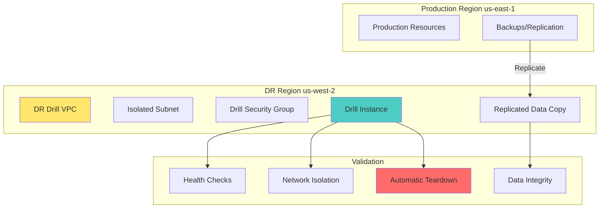

# DRP Testing & Drills

This document defines the methodology for conducting disaster recovery (DR) drills and testing, ensuring recovery environments are functional without impacting production.

## Overview

DR testing validates that recovery infrastructure actually works when needed. This framework implements **non-destructive, sandboxed drills** that prove recovery capability without touching production resources.

## Testing Philosophy

### Core Principles

1. **Non-Destructive** - Drills never modify production data or infrastructure
2. **Sandboxed** - Drill resources are isolated in separate VPCs/subnets with no route to production
3. **Automated** - Most tests are scripted and repeatable
4. **Cost-Aware** - Drill resources are minimal and have automatic teardown
5. **Measurable** - Each test has pass/fail criteria with automated validation

### Drill Types

| Drill Type | Purpose | Frequency | Duration | Cost Impact |
|---|---|---|---|---|
| **Tabletop Exercise** | Validate incident response process | Quarterly | 2 hours | None |
| **Warm Standby Scale-Up** | Test ASG scaling within RTO | Monthly | 1 hour | Low (instance hours) |
| **DRS Recovery Test** | Validate DRS failover capability | Quarterly | 2 hours | Medium (DRS costs) |
| **Data Integrity Check** | Verify replicated data consistency | Weekly | 30 minutes | None |
| **Full Failover Drill** | End-to-end recovery validation | Semi-annually | 4 hours | Medium |

## Drill Architecture



## Drill Execution Workflow

### 1. Pre-Drill Checklist

```bash
# Verify prerequisites
./scripts/testing/validate_drill_prerequisites.sh \
  --dr-region us-west-2 \
  --criticality High
```

**Checks:**
- [ ] DR region has sufficient capacity
- [ ] Replication is current (lag < RPO)
- [ ] Network isolation is configured
- [ ] IAM permissions are valid
- [ ] Cost guardrails are in place

### 2. Launch Drill Instance

```bash
./scripts/testing/launch_drill_instance.sh \
  --ami-id ami-1234567890abcdef0 \
  --instance-type t3.micro \
  --dr-region us-west-2 \
  --subnet-id subnet-abcdef123456 \
  --security-group-id sg-abcdef123456 \
  --purpose DR-Drill \
  --criticality High \
  --dry-run

# After validation
./scripts/testing/launch_drill_instance.sh \
  --ami-id ami-1234567890abcdef0 \
  --instance-type t3.micro \
  --dr-region us-west-2 \
  --subnet-id subnet-abcdef123456 \
  --security-group-id sg-abcdef123456 \
  --purpose DR-Drill \
  --criticality High \
  --confirm
```

**Instance Configuration:**
- **Instance Type:** t3.micro (minimal cost for demo)
- **VPC:** Dedicated DR drill VPC (no peering to production)
- **Subnet:** Isolated private subnet
- **Security Group:** Rules only allowing necessary drill traffic
- **Tags:** `Purpose=DR-Drill`, `DrillID=<timestamp>`, `AutoTeardown=4h`

### 3. Validate Recovery

```bash
# Validate backup integrity
./scripts/testing/validate_backup_integrity.sh \
  --drill-instance-id i-drill-1234567890 \
  --backup-type snapshot \
  --criticality High

# Run application health checks
./scripts/testing/validate_application_health.sh \
  --drill-instance-id i-drill-1234567890 \
  --health-check-endpoint /health
```

### 4. Verify Network Isolation

```bash
# Automated network isolation check
./scripts/testing/verify_network_isolation.sh \
  --drill-instance-id i-drill-1234567890 \
  --production-cidr 10.0.0.0/16
```

**Checks:**
- [ ] No route to production VPC
- [ ] Security group blocks production CIDR
- [ ] No peering connections to production
- [ ] DNS resolution limited to DR region

### 5. Teardown Drill Resources

```bash
# Automatic teardown (after 4 hours or manual)
./scripts/testing/launch_drill_instance.sh \
  --teardown \
  --drill-instance-id i-drill-1234567890 \
  --confirm

# Verify no orphaned resources
./scripts/testing/verify_teardown_complete.sh \
  --drill-id <timestamp>
```

## Warm Standby Scale-Up Test

### Objective

Validate that warm standby ASG can scale up within target RTO.

### Test Procedure

```bash
# Record start time
START_TIME=$(date +%s)

# Scale up warm standby
aws autoscaling set-desired-capacity \
  --auto-scaling-group-name dr-warm-standby-asg \
  --desired-capacity 2 \
  --region us-west-2

# Wait for instances to be healthy
aws autoscaling describe-auto-scaling-groups \
  --auto-scaling-group-name dr-warm-standby-asg \
  --region us-west-2 \
  --query 'AutoScalingGroups[0].Instances[?HealthStatus==`Healthy`]' \
  --output table

# Record end time
END_TIME=$(date +%s)
DURATION=$((END_TIME - START_TIME))

# Validate against RTO target
if [ $DURATION -lt 3600 ]; then
  echo "PASS: Scale-up completed in ${DURATION}s (RTO target: 3600s)"
else
  echo "FAIL: Scale-up exceeded RTO target"
  exit 1
fi
```

### Pass Criteria

- [ ] ASG scales to desired capacity within RTO target
- [ ] All instances pass health checks
- [ ] Instances are accessible in DR VPC
- [ ] No scaling errors in CloudTrail

## Data Integrity Validation

### Objective

Verify that replicated data matches primary region data.

### Test Procedure

```bash
# S3 data integrity check
./scripts/testing/validate_backup_integrity.sh \
  --source-bucket company-data-primary \
  --destination-bucket company-data-replica \
  --check-type checksum \
  --sample-size 100

# RDS data integrity check
./scripts/testing/validate_backup_integrity.sh \
  --source-db production-db-primary \
  --destination-db production-db-replica \
  --check-type row-count \
  --table-name critical_table
```

### Validation Methods

| Method | Data Type | Implementation | Pass Criteria |
|---|---|---|---|
| Checksum comparison | S3 objects | `aws s3api head-object` + MD5 | Checksums match |
| Row count comparison | RDS/DynamoDB | SQL count queries | Row counts match |
| Object count comparison | S3 | `aws s3 ls` | Object counts match |
| Metadata validation | All | Tag/version comparison | Metadata matches |

### Pass Criteria

- [ ] Checksums match for sampled objects
- [ ] Row counts match for sampled tables
- [ ] Object counts match for buckets
- [ ] Replication lag < RPO target
- [ ] No data corruption detected

## DRS Recovery Test

### Objective

Validate that DRS can successfully launch recovery instances in DR region.

### Test Procedure

```bash
# Initiate DRS recovery (simulation mode)
./scripts/recovery/initiate_drs_failover.sh \
  --source-server-id i-source-1234567890 \
  --dr-region us-west-2 \
  --dry-run

# After validation, initiate actual recovery
./scripts/recovery/initiate_drs_failover.sh \
  --source-server-id i-source-1234567890 \
  --dr-region us-west-2 \
  --confirm \
  --purpose DR-Drill
```

### Pass Criteria

- [ ] Recovery instance launches successfully
- [ ] Recovery instance boots from latest recovery point
- [ ] Recovery instance passes health checks
- [ ] Data volumes are attached and accessible
- [ ] Network configuration is correct

## Network Isolation Verification

### Objective

Ensure drill resources cannot access production infrastructure.

### Automated Checks

```bash
# Security group rule analysis
aws ec2 describe-security-groups \
  --group-ids sg-drill-123456 \
  --region us-west-2 \
  --query 'SecurityGroups[0].IpPermissions[?contains(IpRanges[].CidrIp, `10.0.0.0/16`)]'

# Route table analysis
aws ec2 describe-route-tables \
  --route-table-ids rtb-drill-123456 \
  --region us-west-2 \
  --query 'RouteTables[0].Routes[?contains(DestinationCidrBlock, `10.0.0.0/16`)]'

# VPC peering check
aws ec2 describe-vpc-peering-connections \
  --region us-west-2 \
  --query 'VpcPeeringConnections[?AccepterVpcInfo.VpcId==`vpc-production`]'
```

### Pass Criteria

- [ ] Security group blocks production CIDR
- [ ] No routes to production VPC
- [ ] No VPC peering to production
- [ ] DNS resolution limited to DR region
- [ ] No transitive routing paths to production

## Teardown Validation

### Objective

Ensure all drill resources are cleaned up and no orphaned billable resources remain.

### Automated Checks

```bash
# Find resources with drill tag
aws resourcegroupsstaggingapi get-resources \
  --tag-filters Key=Purpose,Values=DR-Drill \
  --resources-per-page 100

# Verify no instances running
aws ec2 describe-instances \
  --filters Name=tag:Purpose,Values=DR-Drill \
  --region us-west-2 \
  --query 'Reservations[].Instances[?State.Name!=`terminated`]'

# Verify no volumes attached
aws ec2 describe-volumes \
  --filters Name=tag:Purpose,Values=DR-Drill \
  --region us-west-2 \
  --query 'Volumes[?State==`available`]'
```

### Pass Criteria

- [ ] All drill instances terminated
- [ ] All drill volumes deleted
- [ ] No drill ENIs remaining
- [ ] No drill security groups (except shared)
- [ ] No drill-specific resources in any service

## Drill Reporting

### Automated Report Generation

```bash
./scripts/testing/generate_drill_report.sh \
  --drill-id <timestamp> \
  --criticality High \
  --output-format html
```

**Report Contents:**
- Drill summary (duration, resources, cost)
- Test results (pass/fail for each test)
- Performance metrics (scale-up time, replication lag)
- Issues identified and remediation steps
- Recommendations for improvement

### Report Distribution

- Upload to S3 bucket for audit trail
- Email to DR team
- Slack notification to #dr-updates channel
- Update DR runbook with lessons learned

## Cost Guardrails

### Automatic Cost Controls

1. **Instance Size Limits** - Drill instances limited to t3.micro/t3.small
2. **Time Limits** - Automatic teardown after 4 hours
3. **Resource Limits** - Maximum 2 instances per drill
4. **Budget Alerts** - CloudWatch budget alert at $10/month for drills

### Cost Monitoring

```bash
# Track drill costs
aws ce get-cost-and-usage \
  --time-period Start=$(date -d '1 day ago' +%Y-%m-%d),End=$(date +%Y-%m-%d) \
  --granularity DAILY \
  --filter '{"And": [{"Dimensions": {"Key": "TAG", "Values": ["Purpose=DR-Drill"]}}]}'
```

## Drill Schedule

### Recommended Schedule

| Drill Type | Frequency | Owner | Duration |
|---|---|---|---|
| Tabletop Exercise | Quarterly | DR Manager | 2 hours |
| Warm Standby Scale-Up | Monthly | Platform Team | 1 hour |
| Data Integrity Check | Weekly | DBA Team | 30 minutes |
| DRS Recovery Test | Quarterly | DR Engineer | 2 hours |
| Full Failover Drill | Semi-annually | DR Team | 4 hours |

### Drill Calendar Integration

```bash
# Schedule automated drills via AWS EventBridge
aws events put-rule \
  --name "MonthlyWarmStandbyDrill" \
  --schedule-expression "cron(0 2 1 * ? *)" \
  --state ENABLED

aws events put-targets \
  --rule "MonthlyWarmStandbyDrill" \
  --targets '[{
    "Id": "1",
    "Arn": "arn:aws:lambda:us-west-2:123456789012:function:execute-warm-standby-drill"
  }]'
```

## References

- [AWS DRS Testing](https://docs.aws.amazon.com/drs/latest/userguide/testing.html)
- [S3 Replication Monitoring](https://docs.aws.amazon.com/AmazonS3/latest/userguide/replication-monitor.html)
- [RDS Read Replica Testing](https://docs.aws.amazon.com/AmazonRDS/latest/UserGuide/USER_ReadRepl.html)
- [NIST SP 800-34 Testing Requirements](https://csrc.nist.gov/publications/detail/sp/800-34/rev-1/final)
